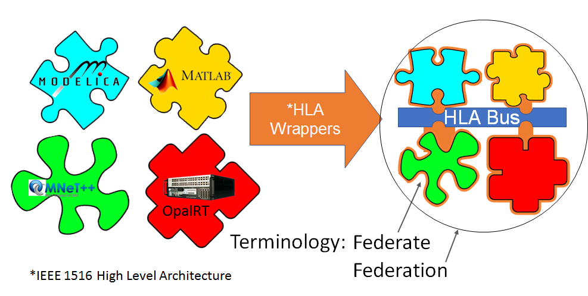

## UCEF Federates and Federated Testbed Architecture
A federated testbed architecture is agnostic to the implementation details and geographic location of the individual entities that participate in an experiment. During one experimental run, the experiment entities might be simulations running on a private cloud hosted in one data center. The next run of the same experiment might replace these simulations with a collection of hardware entities distributed across testbed facilities in the continental United States or abroad. This federated testbed architecture when applied to CPS research must be realized across components and their facilities in order to be able to share resources, reduce costs, and enable experimentation at both broader and larger scales.
 
In addition to the sharing of data and models, federation also implies the capability of a laboratory from one facility providing both control and response signals to a laboratory located at another facility. The interactions in this type of remote federation are not simple data exchanges, and must contain an abstraction of the policies and disciplines employed at each location. This abstraction requires a governance model that communicates research and development priorities, and a contract that describes how the interaction between facilities will be developed and maintained. Furthermore, the laboratories involved must share a common architecture to facilitate data exchange which can be thought of as an open-source platform that provides for the interaction of data, simulation models, and in some cases, control signals.

This section discusses the benefits of a federated testbed architecture for CPS to motivate the need for an open-source platform to realize the concept of remote federation between laboratories.

### Integrative

A CPS contains co-engineered, interacting networks of physical and computational components from multiple domains of technology. These domains – such as smart cities, smart manufacturing, and transportation – each have technologies and simulation engines tailored to their individual needs and experiences. CPS experimentation requires the integration of these heterogeneous, domain-specific tools into a common co-simulation platform. Figure 1 illustrates a subset of the different things that must be integrated together to perform a CPS experiment.

*Figure 1 Ability to federate across sectors and technologies, as well as virtual or real instances of CPS.*

One benefit of a federated testbed architecture is that interactions among heterogeneous federates are abstracted into a common, high level language interface where the abstract representation can be used without regards to domain-specific implementation details. This allows domain-specific simulation languages, experimental prototypes, and proprietary hardware to be integrated into composite experiments without the need to constantly create custom adapters. This adaptation should be achieved in a way that is uniform in the native language of a component to ensure the repeatability of an experiment. Note that it is not necessary to always expose every detail of a component interface for a federated testbed – only so much as is required for collaboration between components.

### Reconfigurable and Reproducible

Once a domain-specific hardware or simulation entity has been wrapped as a federate, it can be easily composed into any number of different federations. This capability to compose experiments from individual federates is inherent to a federated testbed architecture, and facilitates the rapid reconfiguration and reproduction of CPS experiments. Repeatability of experiments is crucial to scientific research, hence the need for a uniform approach to federation.

### Scalable

Experimentation with CPS at scale potentially requires evaluating the behaviors of and interactions among large numbers of individual components. Such components can be modeled using multiple modeling tools, and  wherever required, the behavior of the model can be optimized to match the behavior of its physical equivalent. Once built this way, the models of physical systems can be scaled up to measure system behaviors that otherwise would be difficult to achieve via using physical components due to cost and complexity challenges.

### Usable

A federate produced from a domain-specific entity can be stored in a library with other federates abstracted from different domains. A benefit of federated testbed architectures is a library of reconfigurable federates that combine:

1.	unique or prototype hardware that cannot be relocated,
2.	simulations created in domain-specific languages,
3.	proprietary components.

A federated testbed architecture provides CPS researchers with a rich array of different federates that can be incorporated into experiments without the need for significant development or domain-specific knowledge. As a result, although the HLA-based integration architecture  will constrain the capabilities of a federate, the libraries and common interfaces in a federated architecture add reusability to the development process.
