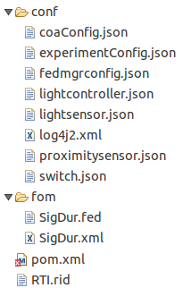

# Running the federation manager

The federation manager needs a federation model to run. A federation model is a WebGME project that contains multiple federates connected by a shared set of interactions. You can either design the federation model from scratch, or use the WebGME import federate feature to bring existing federate models into a single project. This tutorial will use the following federation model as an example.

You must run the federate exporter, implement each federate, and compile the federates using maven prior to working through this tutorial. Then execute the deployment exporter plugin on the WebGME project and extract the generated files to your hard drive. The extracted directory should have the following file structure, with the JSON files named after your individual federates:

The default configuration for the federation manager is sufficient to run the federation on your local computer. Open a terminal, navigate to the deployment directory that contains the file **pom.xml**, and execute the following commands: 

    mvn install
    mvn exec:java -P FederationManagerExecJava

This will run the federation manager and produce the following output:

	[INFO] Scanning for projects...
	[INFO]                                                                         
	[INFO] ------------------------------------------------------------------------
	[INFO] Building SigDur_exec 0.1.0-SNAPSHOT
	[INFO] ------------------------------------------------------------------------
	[INFO] 
	[INFO] --- exec-maven-plugin:1.5.0:java (default-cli) @ SigDur_exec ---
	
	-------------------------------------------------------------------
	GMS: address=vagrant-55943, cluster=FedManager, physical address=127.0.0.1:52243
	-------------------------------------------------------------------
	14:47:46.803 [org.cpswt.host.FederationManagerHostApp.main()] INFO  org.cpswt.host.FederationManagerHostApp - Server online at 127.0.0.1:8083 ...

As shown, the status between two dashed lines shows the federation name (referred to as 'cluster'), and the network address and port number (referred to as 'physical address') where the federates of this federation see each others' messages.

The `Server online at 127.0.0.1:8083` output indicates the federation manager is ready to receive federates, and its RESTful API can be accessed using the listed address. This address can differ from the physical address mentioned above as discussed later in this tutorial.

The final step is to start the federation manager with the following command: 

	curl -i -X POST http://127.0.0.1:8083/fedmgr --data '{"action": "START"}' -H "Content-Type: application/json"

The federation execution will start logical time progression after running the **START** command above, and after all the expected federates have joined the federation.

---

# RESTful API

_RESTful commands to start, stop, pause, and resume a federation's execution.  These are given as complete commands that can copied and pasted into a command line._

### Start execution 
_We assume all federates in the experiment are deployed and running but are in a 'state-of-waiting', i.e. waiting for time stepping to begin._

	curl -i -X POST http://127.0.0.1:8083/fedmgr --data '{"action": "START"}' -H "Content-Type: application/json"

### Stop execution
_Ends the experiment_

	curl -i -X POST http://127.0.0.1:8083/fedmgr --data '{"action": "TERMINATE"}' -H "Content-Type: application/json"

### Pause execution
_Puts the experiment on hold_

	curl -i -X POST http://127.0.0.1:8083/fedmgr --data '{"action": "PAUSE"}' -H "Content-Type: application/json"

### Resume execution 
_Continues an experiment's execution after a pause._

	curl -i -X POST http://127.0.0.1:8083/fedmgr --data '{"action": "RESUME"}' -H "Content-Type: application/json"

### Lists running federates.
_Shows detailed information on every federate about whether it was a federate that was expected to have joined before the federation execution begins, or a federate that could be added to and resigned from the federation at any time during the federation execution (these are called 'LateJoiner' federates). Also, information about the actual time when the federate joined the federation, resigned from the federation, and the mode by which the federate resigned, etc. is also provided._

	curl -i -X GET http://127.0.0.1:8083/federates

---

# Configuring the federation manager
## fedmgrconfig.json

	{
	  "federateRTIInitWaitTimeMs": 200,
	  "federateType": "FederationManager",
	  "federationId": "EchoExample",
	  "isLateJoiner": true,
	  "lookAhead": 0.1,
	  "stepSize": 1,
	  "bindHost": "127.0.0.1",
	  "port": 8083,
	  "controlEndpoint": "/fedmgr",
	  "federatesEndpoint": "/federates",
	  "federationEndTime": 0,
	  "realTimeMode": true,
	  "terminateOnCOAFinish": false,
	  "fedFile": "fom/SigDur.fed",
	  "experimentConfig": "conf/experimentConfig.json"
	}

### Field summary

- federateRTIInitWaitTimeMs -- A sleep period before joining the federation.

- federateType -- Value is set to FederationManager to distguish it from some other type of federate.

- federationId -- The name of the federation (in the above example it is 'EchoExample').  The name of the federation must be the same and must be set in each of the joining federate.

- isLateJoiner -- Must be set to true.

- lookAhead -- Must be smaller that step size. Typically, it is set to an order of magnitude smaller than the federation manager's step size.

- stepSize -- Number of logiclal time units per interation.

- bindHost -- IP address for the RESTful API calls (above).

- port -- Port for the RESTful API calls (above).

- controlEndpoint -- Context for the RESTful API calls (above).

- federatesEndpoint -- RESTful call that outputs a list of running federates.

- federationEndTime -- The time step upon which an experiment ends.  Set to zero for unlimited.

- realTimeMode -- Slows the wall clock time.

- terminateOnCOAFinish -- Determines if the entire federation experiment should be terminated as soon as all courses-of-action (COAs) have been evaluated. This is UNUSED at present, but is expected to be handled in the next UCEF release.

- fedFile - Path to the file that defines the interactions used by this federation.

- experimentConfig -- Path to the file that identifies the federates that participate in this experiment.

## experimentConfig.json
_This file is referenced by the fedmgrconfig.json file (above)._

	{
	  "federateTypesAllowed": [
	    "LightController",
	    "LightSensor",
	    "ProximitySensor",
	    "Switch"
	  ],
	  "expectedFederates": [
	    {
	      "federateType": "LightController",
	      "count": 0
	    },
	    {
	      "federateType": "LightSensor",
	      "count": 0
	    },
	    {
	      "federateType": "ProximitySensor",
	      "count": 0
	    },
	    {
	      "federateType": "Switch",
	      "count": 0
	    }
	  ],
	  "lateJoinerFederates": [
	    {
	      "federateType": "LightController",
	      "count": 1
	    },
	    {
	      "federateType": "LightSensor",
	      "count": 1
	    },
	    {
	      "federateType": "ProximitySensor",
	      "count": 1
	    },
	    {
	      "federateType": "Switch",
	      "count": 1
	    }
	  ]
	}

### Field summary

- federateTypesAllowed -- A collection of names of federates that are permitted to join this federation

- expectedFederates:federateType -- Name of a federate that is expected to join in this federation prior to the start of the federation execution. The field count specifies how many federates of such federate types are to be expected before executing the federation from time 0.0.

- lateJoinerFederates:federateType -- Name of a federate that may join in this federation at any time after the federation has begun executing. The count puts a limit on how many of such 'LateJoiner' federates will be allowed to join. A value of '0' (which is the default), gets rid of this limit.

## log4j2.xml

	<?xml version="1.0" encoding="UTF-8"?>
	<Configuration status="WARN">
		<Appenders>
			<Console name="Console" target="SYSTEM_OUT">
				<PatternLayout pattern="%d{HH:mm:ss.SSS} [%t] %-5level %logger{36} - %msg%n" />
			</Console>
		</Appenders>
		<Loggers>
			<Root level="INFO">
				<AppenderRef ref="Console" />
			</Root>
		</Loggers>
	</Configuration>

	log4j2 suppports several levels of logging. Set the level at <Root level="your level here">.  The most commion log levels levels are WARN, INFO, and DEBUG.  

Find a complete list of log levels [here](http://javapapers.com/log4j/log4j-levels/)

Complete logging documentaion is [here](https://logging.apache.org/log4j/2.x/manual/configuration.html)

---
## RTI.rid
_This files is used to configure the Portico HLA RTI. It contains many different parameters, however, the most important one is shown below. This parameter specifies the network address that will be used by federates of the federation to communicate with each-other._

	# (4.2) JGroups Bind Address
	#        The address/NIC Portico should use. Can use an IP address associated with a NIC, or
	#        one of the following special values:
	#
	#            GLOBAL: Pick a global IP address if available. If not, falls back to a SITE_LOCAL IP address.
	#        SITE_LOCAL: Picks a site local (non routable) IP address, e.g. from the 192.168.0.0 or 10.0.0.0 address range.
	#        LINK_LOCAL: Picks a link-local IP address, from 169.254.1.0 through 169.254.254.255.
	#      NON_LOOPBACK: Picks any non loopback address.
	#          LOOPBACK: Pick a loopback address, e.g. 127.0.0.1.
	#   match-interface: Pick an address which matches a pattern against the interface name, e.g. match-interface:eth.*
	#     match-address: Pick an address which matches a pattern against the host address, e.g. match-address:192.168.*
	#        match-host: Pick an address which matches a pattern against the host name, e.g. match-host:linux.*
	#
	#        DEFAULT: SITE_LOCAL
	#
	portico.jgroups.udp.bindAddress = LOOPBACK

--
## FederationName.fed and FederationName.xml
_These files represent the Federation Object Model (FOM) and contains information about the federates and the set of HLA-interactions and HLA-objects they use for data-sharing._
