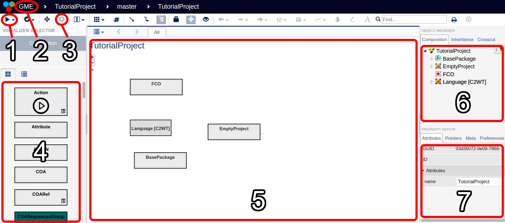

# WebGME Overview
The Web-based Graphical Modeling Environment (WebGME) is an editor used to design HLA federates and experiments.
It contains plugins to facilitate model exchange between different WebGME environments, and code generation capabilities to turn designs into executable code.
This document provides an overview of the WebGME user interface, and references to tutorials on specific topics.

## WebGME User Interface
The following image annotates the important aspects of the WebGME user interface:

1. **Execute Plugin** opens a menu that lists the enabled WebGME plugins. Some plugins are only available at the root level of the project.
2. Clicking on the GME symbol opens the **Project Management** menu where WebGME projects can be created and deleted.
3. Clicking the **Go to parent** button anywhere except in the project root folder will move WebGME one level back in the project hiearchy. It is a convenient shortcut to traverse models without using the object browser.
4. The **Component Palette* contains a list of parts that can be dragged and dropped into the WebGME model. The content of the palette is context sensitive and will change as you traverse a project.
5. This is the main workspace of WebGME where parts can be placed and linked together. You can left click on a part to select it, and drag selected parts to move them. If you double-click on a part, WebGME will change the main workspace to display that part's internal details.
6. The **Object Browser** shows the project hierarchy. The folders can be expanded and contracted using the small arrow icons to the left of the folder names. You can double-click on a folder name to display its content in the main workspace.
7. The **Property Editor** displays the properties of the part currently selected in the main workspace. Left click on a part in the workspace to show its properties. When no part is selected, the editor shows the properties of the opened project folder.

# WebGME Tutorials
- [How to create, delete, import, and export WebGME projects](projects)
- [How to design an HLA federate in WebGME](federates)
- [How to use the WebGME plugins for HLA](plugins)