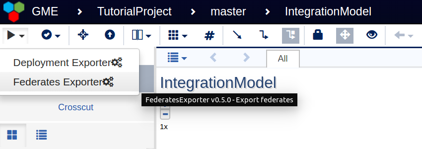
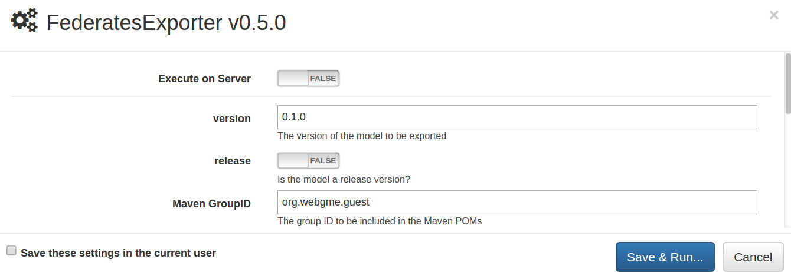
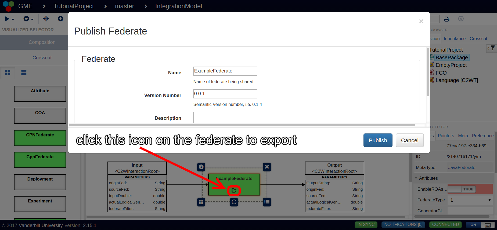
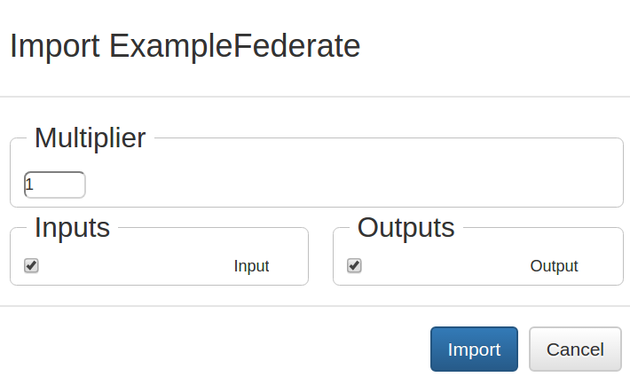

This tutorial discusses how to use the various HLA plugins integrated with WebGME. There are sections for federate code generation, and import/export of WebGME federate models.

# Code Generation Plugins

The UCEF installation of WebGME contains two code generation plugins: deployment exporter and federates exporter. The deployment exporter generates text files useful for running experiments such as scripts to run each federate and the configuration files needed to launch the federation manager. The federates exporter generates code for each federate instance in the WebGME model, where the code generated depends on the federate type that was pulled in from the left component palette. You can access both plugins from the triangle run icon in the top left corner of WebGME as shown below.

When you select either plugin, a new window will pop-up in the center of the screen similar to the one shown below. This window contains settings such as version number which can be changed to modify the code generated output. In most all cases, the default values are acceptable, and the plugin can be executed using the Save & run button.

Clicking save & run will close the plugin window and return the WebGME model. A small rectangle that contains a progress bar will appear in the top right corner. When the progress bar reaches 100 percent, the box will turn either red to indicate failure or green to indicate success. You can view more detailed information on the results, as well as download the generated artifacts in the case of success, through the same execute plugin menu as before. Click the triangle run button in the top left corner, and select the new option that appeared labeled Show results...

The results window will open similar to the one depicted below. If you run more than one plugin in succession, there will be multiple green or red banners that appear in rows to indicate the result of each individual plugin. You can click the Details button to the right of the plugin name to expand the detailed results. Inside the detailed results is a header titled GENERATED ARTIFACTS that contains one or more file names. Left click on each of the file names to download them to the default downloads directory for your browser. You can also right click on the files to save them to a different directory.

# Export Federate to JSON

When you complete a federate model, you might want to export it as a file to your hard drive to either re-use that federate in another federation model, or to transfer that file to a colleague who wants to use the same federate. Each green federate rectangle in a WebGME model contains a decorator below its name that looks like an arrow coming out of a box. When you click this icon, it opens a new window called Publish Federate that can be used to save a textual description of the federate model on your hard drive. 

Inside the publish federate window, you can change the name of the federate and assign a version number. You can also include a small description that will be included in the generated text file for user documentation. Once you are satisfied with the settings, click the Publish button and the browser will download a JSON file to your browser's default download directory. This JSON file is human readable, and can be used in the import plugin described below to transfer the federate to another WebGME model.

# Import Federate from JSON

The import federate plugin is meant to be paired with the export plugin described above. Someone designed a federate model in WebGME, chooses to export their model to a JSON file using the export federate feature, and distributes that JSON file to others who use the import federate feature described here.

When you design a model in WebGME you work from a component called a Federation Object Model (FOM) sheet. The default CPSWT_EmptyProject seed provides a FOMSheet called IntegrationModel where you design federates and federations. Each FOMSheet has a decorator under its name that is an arrow pointing down to a solid line. If you left click on this arrow, the import objects window will open from which you can import a federate JSON file.

From the import objects window, select the blue document icon on the right to open the file browser. Navigate on your file system to the location of the JSON file for the federate you want to import, and select it to continue the import process. This will open an import window tailored to the federate you have selected as demonstrated below.

The multiplier field allows you to select the number of federate instances you wish to import. Reasonable values for the multiplier range from 0 to 20. If you select 0, only the interactions associated with the federate will be imported. If you select a larger number, each federate instance will be named with an increasing integer suffix.

The inputs and outputs columns allow you to select which interactions you wish to import along with the federate. By default, all interactions will be imported. You can deselect the tick boxes to the left of an interaction name to disable the import of that particular interaction.

Click import to complete the process. A progress bar will appear at the top of the import window. When it completes, press the Finish button that appears at the bottom of the window. Then close the import objects window using the X in its top right corner.

Your federates will be imported inside of the FOMSheet that you used to initiate the import process. To access the federates, double click on the FOMSheet to enter its model. In most cases, the federates will be imported at the very bottom of the model and you will have to scroll down a significant length to find them.