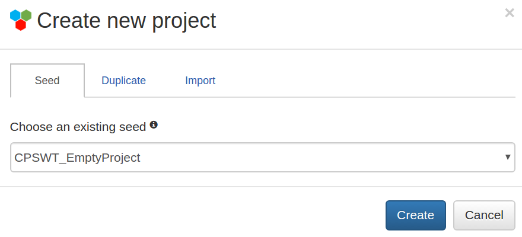
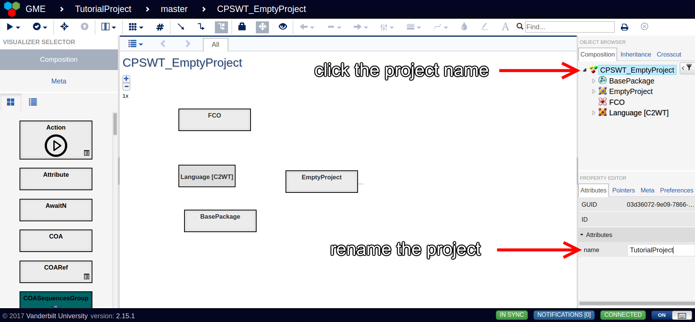
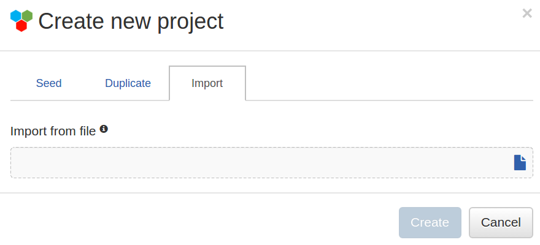
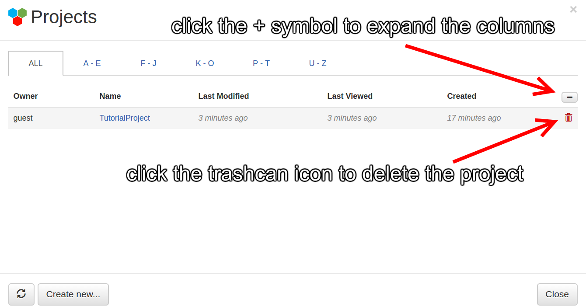

### This tutorial covers how to manage WebGME projects.

* TOC
{:toc}

# Create Project
This section describes how to create an empty WebGME project for HLA modeling.

WebGME automatically opens the project management window when loaded for the first time. You can click on the **Create new...** button in the bottom left corner of this window to create a new project. If the project management window is not open, an alternative method to create a new project is using the GME menu as shown below. You can always access the GME menu by left clicking on either the icon or its associated text in the top left corner of WebGME.

Both of these methods will open the projects window shown below. The default installation of WebGME in UCEF has a single user account named *guest* that will display in the lower left corner. Enter your project name in the bottom text field, and then click the **Create** button to continue to the next screen.

All new projects by default are copied from a seed project configured for HLA modeling. 
When the create new project window opens, click the drop-down menu to select the seed **CPSWT_EmptyProject** which contains the latest HLA definitions for WebGME. Then click the **Create** button to proceed.

As shown in the image above, there are two alternative options to create a new project called *duplicate* and *import*. The import feature is discussed in a later section of this tutorial, while the duplicate feature is seldom used and near identical in function to seed projects. The difference between seeds and duplicates is that duplicate projects retain the revision history of their parent project.

A project created based on the **CPSWT_EmptyProject** seed will open with a root level folder also named CPSWT_EmptyProject. The root folder name is used in lieu of the project name by the WebGME code generation plugins. Therefore, the root folder name must be changed before you start to model. The steps illustrated below change the root folder name.

You can easily verify the root folder name has been changed because the text CPSWT_EmptyProject will disappear from both the top left corner of the WebGME workspace and from the top right object browser. This final step concludes the process of creating a new WebGME project.

# Export Project
This section describes how to export an existing WebGME project into a text file. This feature will be useful when you want to move your models into an updated version of UCEF, or share your models with a colleague who also uses WebGME.

Left click on the GME icon in the top left corner, select **Manage Projects**, and open the project you want to export. From the object browser, select the top-most folder annotated with the GME icon. Right click on this top-most folder, hover over **Export project** from the menu, and left click *with assets* from the submenu. The model will automatically download from your browser to your default downloads directory. The following image shows how to navigate to the export project menu.

# Import Project
This section describes how to import a WebGME project from a text file.

Follow the create a new project tutorial until it asks you to select a seed. Instead of choosing a seed, open the **Import** tab of the **Create new project** window by clicking on the header titled import. This opens the window shown below.

Click the document icon on the far right to open the file browser. From the file browser, select the text file that describes your WebGME model. Verify the correct file name appears under the *Import from file* heading, then click the **Create** button to complete the import.

# Delete Project
This section describes how to delete an existing WebGME project.

Select **Manage Project...** from the top left GME menu to open the project management window. This window by default hides detailed information about each of the projects. To delete a project, you must switch to the detailed project information by clicking on the plus (+) button near the top right of the window. This turns the plus sign into a minus (-) sign and increases the number of columns displayed in the project management window. The detailed project management view is shown below.

A red trashcan symbol appears next to each project in the detailed view. Click the red trashcan symbol to delete the project.